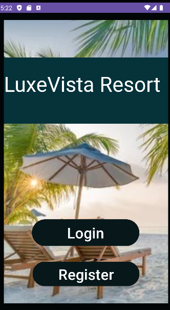
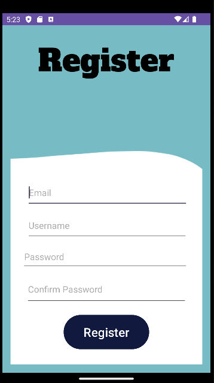
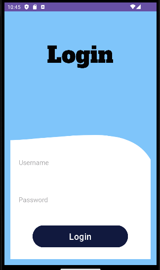
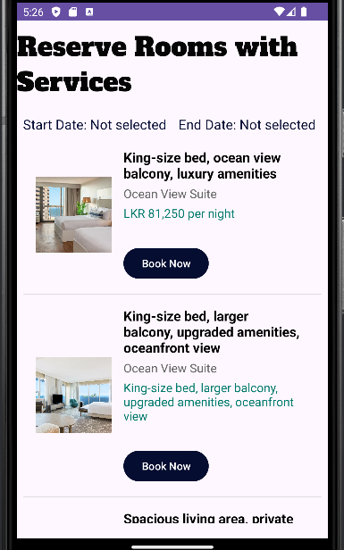
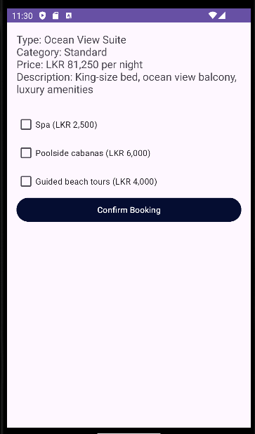
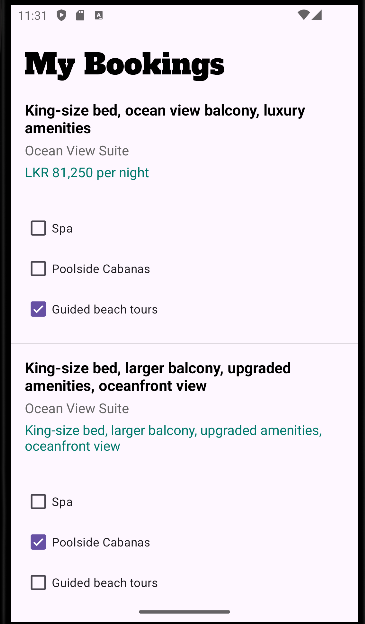

# 🏨 LuxeVista Resort Mobile App

✨ *Elevating luxury stays with seamless bookings and premium guest experiences*

---

## 📱 Key Features  

- 🔐 **User Authentication**: Register and log in with username  
- 🛏️ **Room Booking**: Browse available rooms and book based on preferences (e.g., ocean view suites, deluxe rooms)  
- 💆 **Service Reservation**: Reserve exclusive in-house services like spa treatments, fine dining, and poolside cabanas  
- 🗺️ **Local Attractions**: Explore nearby attractions and get information about hotel offers  

---

## 🖼️ Screenshots  

## 🖼️ Screenshots  

| **Home** | **Register** | **Login** |  
|----------|--------------|----------|  
|  |  |  |  

| **Room Booking** | **Booking Process** | **My Bookings** |  
|------------------|---------------------|----------------|  
|  |  |  |  

---

## 🛠️ Tech Stack  

- **Frontend**: Native Android (Java/Kotlin)  
- **Backend**: Local Database (SQLite or Room for persistence)  
- **Authentication**: Custom email/password login system  
- **Navigation**: Android Navigation Component  
- **UI/UX**: XML for layouts, Material Design Components for UI elements  

---

